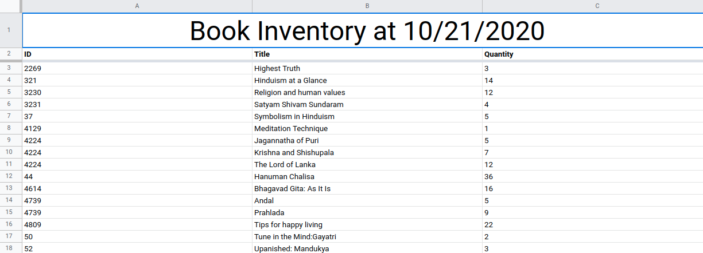

# Sri Venkateswara Temple App
------

This app exists so that volunteers at the gift shop of the Sri Venkateswara Temple (Balaji Mandir) in Bridgewater, NJ, can successfully and efficiently update the inventories of the many items sold. Given that the gift shop has an unconventional labeling system and no Internet connection, the best choice for this task is a mobile application. This application runs on Flutter and can be deployed to Android or iOS.

Instructions to Compile
------

To compile for either Android or iOS, install Flutter from [these instructions](https://flutter.io/setup).

### Compiling for Android

Run `flutter build apk` in the repository root to generate the release APK.

### Compiling to iOS

Complete the necessary setup in Xcode (after plugging the intended device into a Mac) in order to run `flutter build ios` in the repository root.

Distribution
------

  * The APK file at `build/app/outputs/apk/release/app-release.apk` can be shared anywhere, through Drive or e-mail.
  * For iOS, compress the generated app into an IPA file. Using a service such as [Diawi](https://diawi.com), it may be possible to distribute said scouting app without necessarily connecting every device to a Mac. This depends on a number of factors, such as the size of the app, how many times it is to be downloaded, etc. If there is a better way to install iOS apps, please let me know!

Screenshots
------

|   |  |
|:---:|:---:|

Usage
------

All of these instructions for usage are also included in the app itself.

### Counting Items

  * On the Counter screen, there are a few fields that need to be filled out.
    - First, put the ID of the item in the top box.
    - Then, the dropdown below should contain a list of titles for said item - select the right one.
  * If there isn\'t a right one, you can select the plus icon next to it to create an empty text field in which the item title actually goes. If this was a mistake and you want to go back to the dropdown, select the X to the right of the text field.
  * Once you have decided the title of the item from either the dropdown menu or the text field, please enter the correct quantity of items in the quantity box.
  * Once you are done with the above steps, please press the submit button. This action will save the item you just counted to the local inventory.
  * Note that you can choose to reset the inventory at any time you want by going to the Settings screen.

### Uploading

  * If you have a valid internet connection (Wi-Fi or mobile data should you allow it in the Settings screen), you should be able to access the Upload screen.
  * Please duplicate the Template sheet on the Google spreadsheet associated with the app (at [bit.ly/mandirgiftshopsheet](bit.ly/mandirgiftshopsheet)) prior to uploading data.
  * After doing this, you can choose the sheet you just created, and the data from your local inventory should upload to that sheet.
  * The spreadsheet should resemble the following (if done correctly, volunteers can record the entire set of inventories into one or multiple spreadsheets without writing or typing a single word): 

Contact Information
------
If there are any questions or concerns, please contact [Harsh Tiwary](https://github.com/notnotharsh).
